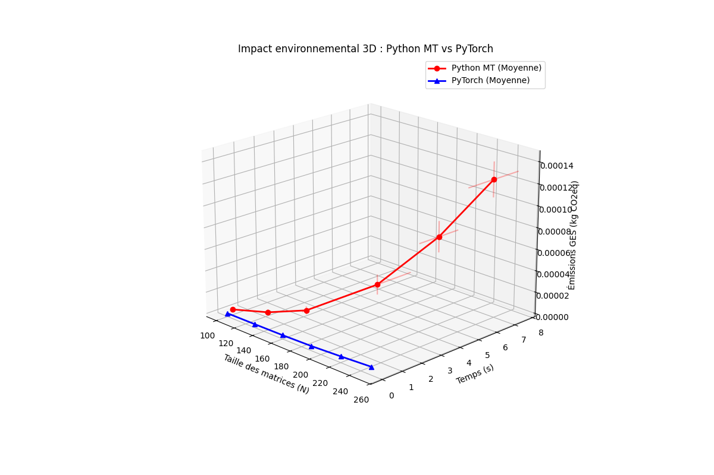

# Analyse et Optimisation de l'Empreinte Environnementale des Services Numériques

## Contexte du Projet
Ce projet a été réalisé dans le cadre du Master **Systèmes Intelligents et IoT** à la Faculté des Sciences de Tunis (Université Tunis El Manar), sous la direction de **Christophe Cérin**. 

L'objectif est d'étudier l'impact carbone du numérique, de l'interface utilisateur (Web) jusqu'au calcul intensif (Intelligence Artificielle).

## Fonctionnalités
Le projet est divisé en quatre axes majeurs :
1. **Audit EcoIndex :** Comparaison entre l'outil en ligne et un script d'audit local automatisé.
2. **Audit Web RGESN :** Analyse de conformité aux 115 bonnes pratiques de GreenIT sur des sites d'actualités et académiques.
3. **Benchmark Énergétique (IA) :** Mesure des émissions de GES d'une opération de *Scaled Dot-Product Attention* (moteur des Transformers).
4. **Optimisation Logicielle :** Comparaison de l'empreinte carbone entre une implémentation Python Multithreadée et une version optimisée avec **PyTorch**.

## Résultats du Benchmark
L'étude démontre que l'utilisation de bibliothèques optimisées comme PyTorch permet de réduire drastiquement la consommation électrique et les émissions de CO2 par rapport à un code Python standard.

*Visualisation 3D de l'impact (Complexité vs Temps vs CO2) :*


## Installation et Utilisation

### Prérequis
- Python 3.11+
- Un environnement virtuel est fortement recommandé.

### Configuration
```bash
# Créer et activer l'environnement virtuel
python -m venv env
source env/bin/activate  # Sur Linux/Mac
.\env\Scripts\activate   # Sur Windows

# Installer les dépendances
pip install -r requirements.txt

Lancement du Benchmark
code Bash

python comparaison_entre_approches.py

Technologies utilisées :

    1. Calcul : PyTorch, Numpy

    2. Mesure GES : CodeCarbon (Offline Mode)

    3. Visualisation : Matplotlib (3D & 2D)

Web : Playwright, Requests, AdvancedHTMLParser

Auteur :
    Moussa Aden Doualeh - GitHub

    Master Informatique : Systèmes Intelligents et IoT